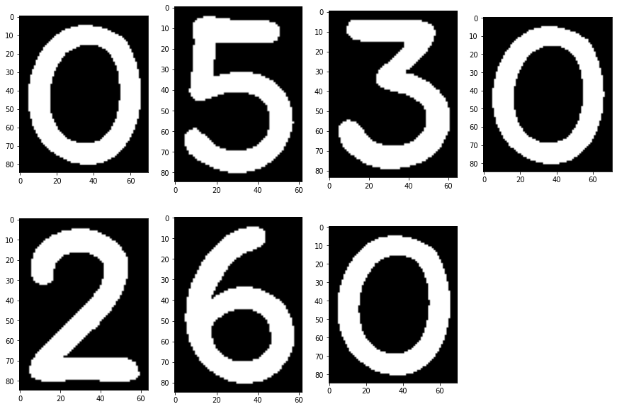

# Warehouse Worker
**_The autonomous robot for smart warehouses._**

# Table of Contents

   * [Abstract](#Abstract)
   * [Unity Simulation](#Unity-Simulation-)
   * [Coppelia Simulation](#Coppelia-Simulation-)
   * [Website & Google APIs](#Website--Google-APIs-)
      * [Website](#Website)
      * [Google APIs](#Google-APIs)
   * [Hardware & 3D design](#hardware--3d-design-)
      * [Hardware Schemes](#Hardware-Schemes)
      * [3D Parts](#3D-Parts)
   * [Video](#Video)

(📖 _You can find much more information about all the sections on each of the different repository wiki pages._)

# Abstract

Our robot works around a warehouse moving and organizing inventory. We have done a simulation in Coppelia in which low-level tasks such as the inverse kinematics of the robotic arm and image recognition tasks are seen. We have also implemented a simulation in Unity in which we abstract from those low-level details and focus on showing the operation of a bigger warehouse with many of our robots, working as a swarm so that the tasks are distributed efficiently between all of them.

Each robot is formed by a base capable of moving thanks to a set of wheels. This base carries a structure with an arm. The arm’s job will be to pick up the packages and drop them in a basket structure located near the arm, so it is able to carry more than one package at the same time. It has a GPS sensor so it is able to know where it is located at every moment, a camera to use computer vision techniques to recognize the texts of the boxes, and a remote wifi connection to receive tasks. We also have designed a website where the warehouse orders are stored, and a human worker can add manually and with his/her own voice orders to be processed by the robot swarm.

In the following sections, we explain a summary of the different features of the robot, **but more information can be seen in the different pages of the repository [wiki](https://github.com/abel-gr/warehouse-robot/wiki)**.

# Unity Simulation [📖](https://github.com/abel-gr/warehouse-robot/wiki/Unity-simulation)

The Unity simulation consists of multiple robots that work collaboratively to collect boxes from a warehouse and transport them to the unloading area. To efficiently collect the boxes, scripts have been implemented scripts that allow the robots to be controlled as a swarm to assign to each task the optimal robot depending on some metrics and a training system that modifies the weights of the formula of assignment to get the optimal results. In addition, each robot is completely autonomous and has functions for calculating and following optimal routes, detection, and prevention of collisions, and **many more functionalities that can be read in the [section of the wiki dedicated exclusively to Unity](https://github.com/abel-gr/warehouse-robot/wiki/Unity-simulation)**. 

## Coordinated robot swarm

The robots are assigned in a coordinated way to collect the different boxes from the warehouse with strategies that minimize the distances that each robot must collect. A formula numerically determines which robot is the most suitable among those available to be assigned to pick up a box.

In addition, a script has been implemented that can be activated to carry out automatic training to search the weights that minimize the total time of the collection of boxes from the warehouse between all the robots. When the training mode is enabled after a certain number of orders are processed by the robots, the weights of the formula used to determine which robot is the most suitable for picking an order are modified in each iteration. It repeats the process numerous times and saves the optimal values that minimize the total order processing time in _PlayerPrefs_ so that they persist after execution and can be used again.

If you want to add more robots to the swarm, all you have to do is to add the prefab of the robot that we have designed to the Unity scene all the times you want. All the scripts automatically detect in their start all the robots that are in the warehouse so there is no need to modify any line of code when adding new robots thanks to the scalable design we have made of our scripts.

## Nodes with a single direction of circulation

The warehouse is mapped as a directed graph. To make the warehouse instantly scalable without the need to make changes to existing systems, the information of the nodes is summarized in 4 simple variables: 2 integers and 2 booleans. The two integers symbolize the set of nodes to which each node belongs and is connected, and the two booleans indicate whether the X and Z direction to be followed at that node is positive or negative. In this way, the edges are not really saved anywhere, but our algorithm knows quickly and efficiently which nodes are connected, and which directions those connections are allowed. There is more information about these four variables in the [wiki section of the Warehouse_node.cs script](https://github.com/abel-gr/warehouse-robot/wiki/Unity-simulation#Warehouse_nodecs).

As a result of implementing this system, the generation of edges of the nodes is completely automated and scalable, and it also incorporates into the warehouse that the nodes have a single direction of circulation, avoiding possible head-on collisions between robots.

In addition, these 4 variables can be changed quickly from the Unity Inspector of the Node's GameObject in case you want to modify the mapping of the warehouse. You can also add new nodes without having to specify the edges one by one. You just have to modify the four variables that we indicated. In this way, the warehouse and its node mapping are scalable almost instantly and very comfortably, and the robots will be able to circulate through the new nodes without a problem. The script that calculates the optimal routes between nodes will take into account the new nodes, their edge connections, and their driving directions. And all this without the need to modify a single line of code by the user, thanks to the scalable design that we have made of all our scripts.

## Autonomous robots

All robots have scripts for calculating optimal routes between the different nodes and they can follow the optimal route made up of different nodes to go from any point of the warehouse to any other. In case the robot is not in any node because it was outside the warehouse (for example if the robot is charging its battery and it is outside), the robot detects that it is not in any node and automatically finds the location of the closest node and goes towards it.

Each robot is implemented to be able to work independently and alone in case the swarm did not exist. What the swarm script really does is, once it has determined which robot should be assigned to a task and a location, it calls the robot script's own functions. When it assigns a robot to pick up an order, it changes the robot status to _OnWayToPick_ to ensure that it does not accept any other tasks until it is finished (more information about this process in the [Warehouse_orders.cs section](https://github.com/abel-gr/warehouse-robot/wiki/Unity-simulation#Warehouse_orderscs) and the [Robot.cs section](https://github.com/abel-gr/warehouse-robot/wiki/Unity-simulation#Robotcs)). 

Proximity sensors have been simulated through triggers and box colliders that allow robots to stop when they detect that they have a robot in front of them. In addition, they also stop giving priority to the robots that they detect on their right. Head-on collisions cannot occur because all nodes have a single direction of driving.

The robot also obtains the angle between its direction and the vector of the location it wants to go and automatically rotates the necessary degrees to always head straight to the target location.

For more realism, servomotors and wheels have also been simulated to rotate depending on the same speed variable at which the robot moves, so that the faster the robot moves, the faster its wheels also rotate. You can find extra information about the operation of the wheels and their safety lock conditions in the [section of the Robot_wheels.cs script](https://github.com/abel-gr/warehouse-robot/wiki/Unity-simulation#Robot_wheelscs). 

Each robot has a state that allows the other scripts to know what they can and cannot do with them, as well as the robot itself blocks or allows certain actions in each state. For example, the robotic arm is locked in all states except in the _PickingUp_ state. The robot can only receive new tasks in the _Available_ state. Also, in the _PickingUp_, _RampGoingDown_, _Unloading_, and _RampGoingUp_ states, the rotation of the robot and wheels is automatically locked. For more information about the robot states, its safety restrictions, and its transitions, you can refer to the [Robot.cs section](https://github.com/abel-gr/warehouse-robot/wiki/Unity-simulation#Robotcs).

The robot is highly customizable and most of its variables can be modified directly from the Unity inspector, including its speed of movement, its speed of rotation, and its maximum load capacity among others.

## Scalable robot arm script

A fully scalable robotic arm control script has been designed so all the desired joints and axes can be easily added by quickly editing the game object settings from the Unity inspector. Allows you to configure each axis by adjusting its axes of rotation, its minimum and maximum angles, its rotation speed, and its associated Transform Object.

A simulation of a pneumatic actuator has been incorporated that is capable of picking up boxes and storing them into the robot basket.

More information about the robotic arm and the actuator can be found on the [Robot_arm.cs section](https://github.com/abel-gr/warehouse-robot/wiki/Unity-simulation#Robot_armcs) and the [Robot_actuator.cs section](https://github.com/abel-gr/warehouse-robot/wiki/Unity-simulation#Robot_actuatorcs).

## Unloading ramp

When the robots detect that they have reached their maximum box load capacity, if they are in the _Available_ state, they automatically change their state to _OnWayToDrop_ and go to the unloading zone. There, the robots unload the boxes smoothly with its rotatable ramp on a conveyor belt that takes them to a large container. You can read much more detailed information about this process and robot state changes in the [wiki section of the Robot.cs script](https://github.com/abel-gr/warehouse-robot/wiki/Unity-simulation#Robotcs).

# Coppelia Simulation [📖](https://github.com/abel-gr/warehouse-robot/wiki/Coppelia-simulation "Coppelia Simulation Wiki")

## Optical Character Recognition for box recognition

When we receive the image from the camera we process it to find out the identification number from the box. We crop and binarize the image and then, using a labeling algorithm 
with connectivity to 8, we assign a number to each region:

Since we have the image in which each letter or number has a region with a unique number, we can easily find a bounding box for each letter, segment them and crop them:

Now each cropped image is passed to a multi-layer perceptron that we have trained ourselves (and serialized, so that the training process only needs to be done once). We get the 
class it belongs to, and each class belongs to a letter or number so we get the ID of the box in string format.

## Realistic Simulation

CoppeliaSim is a realistic robotics simulator where you can develop robots from scratch. It also has a Python API which you can use to bring intelligence to your robot. In our 
case, we have combined Computer Vision and Robotics to create a robot that is able to carry two packages at the same time and identify them. Ideal for warehouses or factories.

### Precise kinematics

The arm of our robot has 4 axes, the minimum to be able to comfortably make the movement of picking up a box with a suction cup from the upper part, which is the one with the 
best grip, and placing it in the basket.

The Denavit-Hartenberg matrix of our arm is as follows:

| Axis 	| θ  	| d  	| a  	| α	|
|------	|---------	|----	|----	|--------	|
| 1    	| &theta;1	| l1 	| 0  	| 90º   |
| 2    	| &theta;2	| 0  	| l2 	| 0     |
| 3    	| &theta;3	| 0  	| l3 	| 0     |
| 4    	| &theta;4	| 0  	| l4  	|     	|

As we have 4 angles and only 3 equations we cannot solve the system. So we must apply another method of inverse kinematics other than solving the system. We could use mechanical decoupling but in this case, we prefer to use the geometric method.

See [Geometric approach to inverse kinematics](https://www.researchgate.net/publication/228412878_Geometric_approach_to_inverse_kinematics_for_arm_manipulator) for more information about the geometrical model of a robotic arm.

### Ready to use library

We have coded a very easy-to-use library where a complex order for a robot is coded with just 8 lines. 

With this code we are telling our robot to do this specific order {TAKE 5241730 & 0530260 DELIVER TO DROP_ZONE_A, DROP_ZONE_B} as we can see, this means the robot has to take the packages with the id code 5241730 and 0530260 and deliver them to a specific drop zone.

### Delivery Service

The robot can deliver specific packages to specific places due to its GPS-guided moving system, and his basket.

# Website & Google APIs [📖](https://github.com/abel-gr/warehouse-robot/wiki/Website-&-Google-APIS "Website & Google APIs Wiki")

A web page has also been created for this project in order to manage the stock of the warehouse where the swarm operates. Apart from this, you can also create orders for the robots.
To make possible some of the functionalities of this website, several Google Cloud APIs have been used.

## Website

The website offers a visual representation of the warehouse stock. As mentioned above, it also allows operators to create orders either manually with buttons and text dialogues or with their own voice.

## Google APIs

To make possible many of the functionalities of the website, we have used some of the APIs offered by Google Cloud. Between them:
* Firebase.
* Cloud Functions.
* Speech to Text.
* Vertex AI.

The following diagram summarizes the modules of the warehouse website graphically:

# Hardware & 3D design [📖](https://github.com/abel-gr/warehouse-robot/wiki/Hardware-&-3D-design "Hardware & 3D design Wiki")

Each robot of the swarm is the same, and they are formed by some 3D parts and the hardware and electronic pieces needed to make them perform.

## Hardware Schemes

These are electronic schemes of both of the computers used in a robot.
* Arduino:

* Raspberry Pi:

## 3D Parts

These are some of the parts that form the robot:

* Base & Basket:

* Basecone & Shoulder plate:

* Shoulder shell & Forearm:

* Elbow shell & Upper arm:

* Wirst shell & Shorter upper arm:

# Video
A short video showing all the functionalities of the project.

###### Click the image for the full video!

# Authors

* [Abel García](https://github.com/abel-gr)
* [Javier de Dios](https://github.com/JavierdeDios)
* [Arnau Mayoral](https://github.com/maymac00)
* [Núria Martínez](https://github.com/nuriamba)
