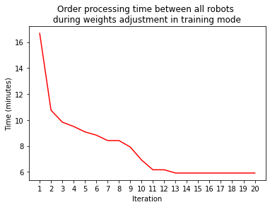
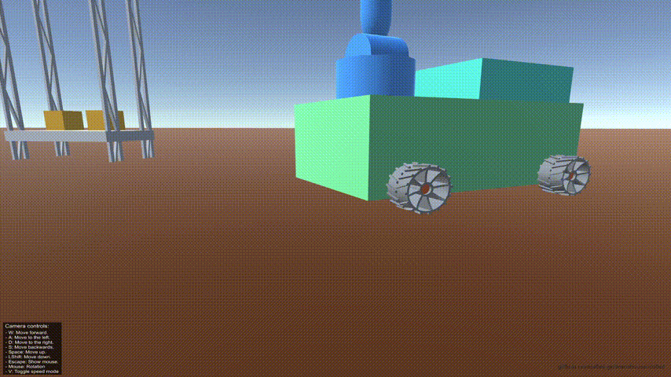
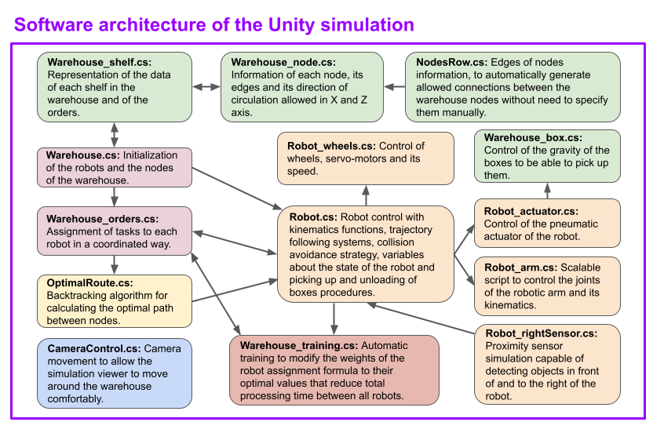
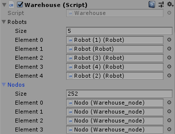
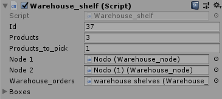
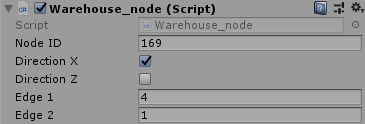
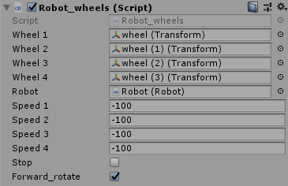

# Unity simulation

The Unity simulation consists of multiple robots that work collaboratively to collect boxes from a warehouse and transport them to the unloading area. To efficiently collect the boxes, scripts have been implemented that allow the robots to be controlled as a swarm to assign to each task the optimal robot depending on some metrics and a training system that modifies the weights of the formula of assignment to get the optimal results. In addition, each robot is completely autonomous and has functions for calculating and following optimal routes, detection and prevention of collisions and many more functionalities that can be read below.

**Below the summary of the functionalities you will find more detailed information about each of the implemented scripts.**

# Table of contents

   * [Simulation features](#Simulation-features)
      * [Coordinated robot swarm](#Coordinated-robot-swarm)
      * [Nodes with a single direction of circulation](#Nodes-with-a-single-direction-of-circulation)
      * [Autonomous robots](#Autonomous-robots)
      * [Scalable robot arm script](#Scalable-robot-arm-script)
   * [Scripts information](#Scripts-information)
      * [Software Architecture](#Software-Architecture)
      * [Robot.cs](#Robotcs)
      * [Warehouse.cs](#Warehousecs)
      * [Warehouse_orders.cs](#Warehouse_orderscs)
      * [Warehouse_shelf.cs](#Warehouse_shelfcs)
      * [Warehouse_node.cs](#Warehouse_nodecs)
      * [OptimalRoute.cs](#OptimalRoutecs)
      * [Robot_rightSensor.cs](#Robot_rightSensorcs)
      * [NodesRow.cs](#NodesRowcs)
      * [Robot_arm.cs](#Robot_armcs)
      * [Warehouse_training.cs](#Warehouse_trainingcs)
      * [CameraControl.cs](#CameraControlcs)
      * [Robot_actuator.cs](#Robot_actuatorcs)
      * [Warehouse_box.cs](#Warehouse_boxcs)
      * [Robot_wheels.cs](#Robot_wheelscs)

# Simulation features

## Coordinated robot swarm

The robots are assigned in a coordinated way to collect the different boxes from the warehouse with strategies that minimize the distances that each robot must collect. A formula numerically determines which robot is the most suitable among those available to be assigned to pick up a box.

In addition, a script has been implemented that can be activated to carry out automatic training to search the weights that minimize the total time of the collection of boxes from the warehouse between all the robots. When the training mode is enabled, after a certain number of orders processed by the robots, the weights of the formula used to determine which robot is the most suitable for picking an order are modified in each iteration. It repeats the process numerous times and saves the optimal values that minimize the total order processing time in _PlayerPrefs_ so that they persist after execution and can be used again.

If you want to add more robots to the swarm, all you have to do is to add the prefab of the robot that we have designed to the Unity scene all the times you want. All the scripts automatically detect in their start all the robots that are in the warehouse so there is no need to modify any line of code when adding new robots thanks to the scalable design we have made of our scripts.

## Nodes with a single direction of circulation

The warehouse is mapped as a directed graph. To make the warehouse instantly scalable without the need to make changes to existing systems, the information of the nodes is summarized in 4 simple variables: 2 integers and 2 booleans. The two integers symbolize the set of nodes to which each node belong and is connected, and the two booleans indicate whether the X and Z direction to be followed at that node is positive or negative. In this way, the edges are not really saved anywhere, but our algorithm knows quickly and efficiently which nodes are connected, and which directions those connections are allowed. There is more information about these four variables in the [Warehouse_node.cs script section](#Warehouse_nodecs) below this page.

As a result of implementing this system, the generation of edges of the nodes is completely automated and scalable, and it also incorporates into the warehouse that the nodes have a single direction of circulation, avoiding possible head-on collisions between robots.

In addition, these 4 variables can be changed quickly from the Unity Inspector of the Node's GameObject in case you want to modify the mapping of the warehouse. You can also add new nodes without having to specify the edges one by one. You just have to modify the four variables that we indicated. In this way, the warehouse and its node mapping are scalable almost instantly and very comfortably, and the robots will be able to circulate through the new nodes without a problem. The script that calculates the optimal routes between nodes will take into account the new nodes, their edge connections, and their driving directions. And all this without the need to modify a single line of code by the user, thanks to the scalable design that we have made of all our scripts.

## Autonomous robots

All robots have scripts for calculating optimal routes between the different nodes and they can follow the optimal route made up of different nodes to go from any point of the warehouse to any other. In case the robot is not in any node because it was outside the warehouse (for example if the robot is charging its battery and it is outside), the robot detects that it is not in any node and automatically finds the location of the closest node and goes towards it.

Each robot is implemented to be able to work independently and alone in case the swarm did not exist. What the swarm script really does is, once it has determined which robot should be assigned to a task and a location, it calls the robot script's own functions. When it assigns a robot to pick up an order, it changes the robot status to _OnWayToPick_ to ensure that it does not accept any other tasks until it is finished (more information about this process in the [Warehouse_orders.cs section](#Warehouse_orderscs) and the [Robot.cs section](#Robotcs)).

Proximity sensors have been simulated through triggers and box colliders that allow robots to stop when they detect that they have a robot in front of them. In addition, they also stop giving priority to the robots that they detect on their right. Head-on collisions cannot occur because all nodes have a single direction of driving.

The robot also obtains the angle between its direction and the vector of the location it wants to go and automatically rotates the necessary degrees to always head straight to the target location.

For more realism, servomotors and wheels have also been simulated to rotate depending on the same speed variable at which the robot moves, so that the faster the robot moves, the faster its wheels also rotate. You can find extra information about the operation of the wheels and their safety lock conditions in the [section of the Robot_wheels.cs script](#Robot_wheelscs).

Each robot has a state that allows the other scripts to know what they can and cannot do with them, as well as the robot itself blocks or allows certain actions in each state. For example, the robotic arm is locked in all states except in the _PickingUp_ state. The robot can only receive new tasks in the _Available_ state. Also, in the _PickingUp_, _RampGoingDown_, _Unloading_, and _RampGoingUp_ states, the rotation of the robot and wheels is automatically locked. For more information about the robot states, its safety restrictions, and its transitions, you can refer to the [Robot.cs section](#Robotcs).

The robot is highly customizable and most of its variables can be modified directly from the Unity inspector, including its speed of movement, its speed of rotation, and its maximum load capacity among others.

## Scalable robot arm script

A fully scalable robotic arm control script has been designed so all the desired joints and axes can be easily added by quickly editing the game object settings from the Unity inspector. Allows you to configure each axis by adjusting its axes of rotation, its minimum and maximum angles, its rotation speed, and its associated Transform Object.

A simulation of a pneumatic actuator has been incorporated that is capable of picking up boxes and storing them into the robot basket.

More information about the robotic arm and the actuator can be found on the [Robot_arm.cs section](#Robot_armcs) and the [Robot_actuator.cs section](#Robot_actuatorcs).

## Unloading ramp

When the robots detect that they have reached their maximum box load capacity, if they are in the _Available_ state, they automatically change their state to _OnWayToDrop_ and go to the unloading zone. There, the robots unload the boxes smoothly with its rotatable ramp on a conveyor belt that takes them to a large container. You can read much more detailed information about this process and robot state changes in the [Robot.cs script section](#Robotcs) further down this page.

***

# Scripts information

## Software Architecture

## Robot.cs

Contains all the procedures that control the basic behavior of the robot. With only this script the robot is able to work by itself. It contains the functions that allow the robot to move to the location of a certain node, as well as to follow a certain node path.

Before going to each node, the robot obtains the angle between its direction and the vector of the location it wants to go and automatically rotates the necessary degrees to always head straight to the target location and to go always forward to the target. We allow the robots to know their own position in the Unity simulation because in the Hardware design we added a GPS sensor to them.

Variable _containerCapacity_ is the total number of boxes that a robot can store in its container and variable _containerFilled_ is the number of boxes that are in the robot container.

The robot has attached a _Robot_rightSensor.cs_ typescript that indicates when the sensor detects other robots. This is used for robots to automatically prioritize other robots that are in their right and also stopping when having robots in front, waiting for them to go, and avoiding collisions.

In case the robot needs to travel along a route between nodes but is not in a node yet, it automatically detects that situation and goes to its closest node, to then start the route correctly.

Each robot contains a state that allows the other scripts to know whether or not they can assign tasks to each robot:

* NotReady: The robot has not yet reached its closest node and is not yet ready to receive any tasks.
* Available: The robot is not performing any task and can be assigned to one.
* OnWayToPick: The robot has been assigned an order to pick up and is on its way to the shelf location.
* PickingUp: The robot has reached the shelf where the order to be picked up is located and is moving the robotic arm to pick it up.
* OnWayToDrop: The robot has received the order to deliver the orders that it has picked up so far and that is stored in its basket.
* PrepareUnloading: The robot has reached the order unloading area and is rotating until the necessary rotation to be able to unload the boxes correctly.
* RampGoingDown: The robot ramp is going down so that the boxes on it can be unloaded into their cargo container.
* Unloading: The robot is busy unloading its boxes.
* RampGoingUp: The ramp is going up again after the boxes are unloaded.

The state of the robot also indicates itself what it can and cannot do. For example, in the _PickingUp_, _RampGoingDown_, _Unloading_, and _RampGoingUp_ states, the rotation of the robot and wheels is automatically locked.

The robot starts in the _NotReady_ state since it is out of the warehouse and therefore it is not in any node. The robot is able to detect it since it has the location of all the nodes. It finds its closest node and rotates to always go straight towards it. It begins to go towards him and once he arrives he changes his status to _Available_ because now the robot is located in one of the nodes of the warehouse.

Since it is in the _Available_ state, the _Warehouse_orders.cs_ script will assign the robot a box to pick up, and it will change the robot state to _OnWayToPick_. Once it reaches the location of the box, the robot itself will change its status to _PickingUp_, automatically locking the wheels and allowing the arm to move (in the other states the robotic arm is locked for safety). Once it has picked up the box, its status is _Available_ again. In case that the container is full, the robot itself will set the _OnWayToDrop_ status and go to the box unloading area. Otherwise, it will remain in _Available_ until the _Warehouse_orders.cs_ script assigns it another box to collect, and the process will start again.

As we said, if the robot reaches its maximum box capacity, if it is in the _Available_ state, it automatically changes its own state to _OnWayToDrop_ so that the swarm does not assign it any more tasks, and it goes to the order unloading area. Once it arrives, it changes the status to _PrepareUnloading_, which means that it is rotating until it reaches the rotation with which it can unload the boxes correctly. Once rotated, its status becomes _RampGoingDown_ while going down the ramp. Once unloaded the orders, the status is _Unloading_ while waiting for the boxes to be lowered onto a conveyor belt that places them in a large container for processing. Then its status changes to _RampGoingUp_ while the ramp goes up again. Once the ramp is fully up, it changes its status back to _Available_ so that it can be assigned another task.

The robot is highly customizable and most of its variables can be modified directly from the Unity inspector, including its speed of movement, its speed of rotation, and its maximum load capacity among others. If you want to add more robots to the swarm, all you have to do is to add the prefab of the robot that we have designed to the Unity scene all the times you want. All the scripts automatically detect in their start all the robots that are in the warehouse so there is no need to modify any line of code when adding new robots.

## Warehouse.cs

It has two lists: One of all the robots that are in the scene, and the other containing all the nodes in the warehouse. This script is responsible for initializing all nodes and robots, as well as ensuring that all robots are ready after going to their nearest node to start collecting orders for the first time. With the method _setRobotRoute_ this script can assign routes to the robots, from any node to any other, or specifying that it wants the route to start from the closest node where the robot is.

## Warehouse_orders.cs

It is in charge of assigning tasks to each robot, such as which orders to pick up and on which specific shelves, in an efficient and coordinated way with all the other robots. To decide which robot should be assigned to a task, a metric is calculated for all robots that have the status of _Available_, and the robot with the lowest metric is assigned. The calculation of the formula includes values such as the distance to the order, the number of orders processed and the capacity of each robot, and all the values have certain weights that are calculated in the _Warehouse_training.cs_ script.

When the _Warehouse_orders.cs_ script decides which are the optimal robots to carry out a task, it calls the own functions of the _Robot.cs_ script of the chosen robot so that each robot is in charge of carrying out the tasks assigned to it and change its own status back to _Available_ when it completes them so that the _Warehouse_orders.cs_ script can assign the robot another task. This makes each robot autonomous and not dependent on the swarm.

When it assigns a robot to pick up an order, it changes the robot status to _OnWayToPick_ to ensure that it does not accept any other tasks until it is finished.

There is also a basic assignment system that assigns the tasks to the first robot that is available in case you do not want to use the advanced assignment that uses metrics and weights. However, the advanced system is really quick to calculate.

To know which orders need to be assigned, it checks the pending orders variable of the objects of type _Warehouse_shelf.cs_.

## Warehouse_shelf.cs

It has variables with information about the products that the shelf contains, as well as its maximum and current quantity. It is capable of generating new orders that will be processed by the _Warehouse_orders.cs_ script. Contains a list with references to Warehouse_box.cs type objects that are the boxes located on that shelf.

Each shelf script has two _Warehouse_node.cs_ scripts associated to it, of the nodes that are at the left and the right of that shelf, allowing the robots to know the node coordinates of the shelf where is the box that must be picked up.

If you want to add orders from a database or an external system, it is as simple as modifying only the _products_to_pick_ variable of the shelves that you want to have pending orders. It is not necessary to modify anything else, since the _Warehouse_Orders.cs_ script will detect the change in that variable in all the _Warehouse_shelf.cs_ scripts and it will be in charge of controlling the swarm of robots, assigning the task to the optimal robot automatically without the need to change anything, making the ordering system very adaptable to other technologies.

## Warehouse_node.cs

The variable _Edge1_ contains an integer that represents a set of nodes that are connected along the Z-axis. The same goes for the variable _Edge2_ for the X-axis. This means that if two nodes have the same value in their variable _Edge1_, there is an edge between them that connects them along the Z-axis. By doing this, the generation of edges in the warehouse is fully automated.

To avoid head-on collisions between the robots, one-way rails have been implemented in the warehouse. For this, each node has a unique direction in each axis (X and Z). They are represented in the variables _directionX_ and _directionZ_. When one of these two variables is _true_, it means that if the robot is in that node, it will be able to move towards a value of X (or Z depending on the variable) that is greater than the one it is, that is, in a positive direction. If it is false, it can only move in the negative direction. In this way, lane generation is also automated and works perfectly.

In this way, the edges are not really saved anywhere, but our algorithm knows quickly and efficiently which nodes are connected, and which directions those connections are allowed.

Furthermore, node variables, their directions, and their edge connections can be quickly changed from the Unity inspector. We have done it this way to allow the warehouse structure to be modified really quickly. It is highly scalable since if you want to add new nodes it is only necessary to add the corresponding prefab that we have created to the scene and set only 4 variables from the Unity inspector. The robots will be able to circulate through them without a problem and with the desired circulation restrictions without the need to modify any single line of code thanks to the scalable design that we have made of all our scripts. The _nodeID_ does not need to be modified and is generated automatically when starting the simulation.

## OptimalRoute.cs

It has a recursive backtracking algorithm to calculate the optimal path between two warehouse nodes. It has various conditions to prune branches so it runs fast.

## Robot_rightSensor.cs

Using box colliders established as triggers, it simulates a proximity sensor capable of detecting objects in front of and to the right of the robot. When it detects or stops detecting a collision, it modifies the _rightSensorCollision_ variable of the _Robot.cs_ to which it is associated, being the _Robot.cs_ the script in charge of determining what to do when the collision occurs (more info about that process can be found in the [Robot.cs section](#Robotcs)).

## NodesRow.cs

It contains a _RowID_ variable that is checked by the _Warehouse_node.cs_ objects that are in that row to generate its Edge2 variable. This is made to automatize the edge generation.

## Robot_arm.cs

It is a highly scalable script that contains information about each of the robotic arm's joints. It contains procedures for its kinematics. The arm script is designed in such a way that you can add all the new joints that you want from the Unity Inspector's game object settings without having to modify any line of code of this script. You can also easily configure its axis of rotation, its rotation speed, and its minimum and maximum allowed angles from the Unity Inspector.

## Warehouse_training.cs

When the training mode is enabled, after a certain number of orders are processed by the robots, this script automatically modifies the weights of the formula used to determine which robot is the most suitable for picking an order. In each iteration, the weights are modified with the inverse of the time it took for all the robots to process a certain number of orders specified in the _ordersPerIteration_ variable. It repeats the process numerous times and saves the optimal values that minimize the total order processing time. That optimal weights are saved in _PlayerPrefs_ so that they persist after execution and can be used again.

## CameraControl.cs

It allows the person that is viewing the simulation to move comfortably around the scene, rotating the camera with the mouse and moving around the warehouse with the following controls:

* W: Move forward.
* A: Move to the left.
* D: Move to the right.
* S: Move backward.
* Space: Move up.
* LShift: Move down.
* Escape: Show mouse.
* Mouse: Rotation
* V: Toggle speed mode, between fast and slow camera speed movements.

## Robot_actuator.cs

Simulates the behavior of a pneumatic actuator by using triggers and box colliders, allowing the robot to pick up and drop boxes.

## Warehouse_box.cs

It is a simple script that allows controlling the effects of gravity and position of the boxes when they are picked up by the pneumatic actuator.

## Robot_wheels.cs

It simulates the movement of the servo-motors and the wheels of each robot to which this script is associated. The speed of the wheels is passed as a parameter from the robot. In the case of being stationary, this script also stops automatically the servos and wheels with the _stop_ variable indicated by the robot. 

The associated _Robot.cs_ controls the _Robot_wheels.cs stop_ variable to lock the wheels in all the states in which they should not move. For example, in the _PickingUp_, _RampGoingDown_, _Unloading_, and _RampGoingUp_ states, the rotation of the robot and wheels is automatically locked.

###### _[BACK HOME](https://github.com/abel-gr/warehouse-robot/wiki)_
