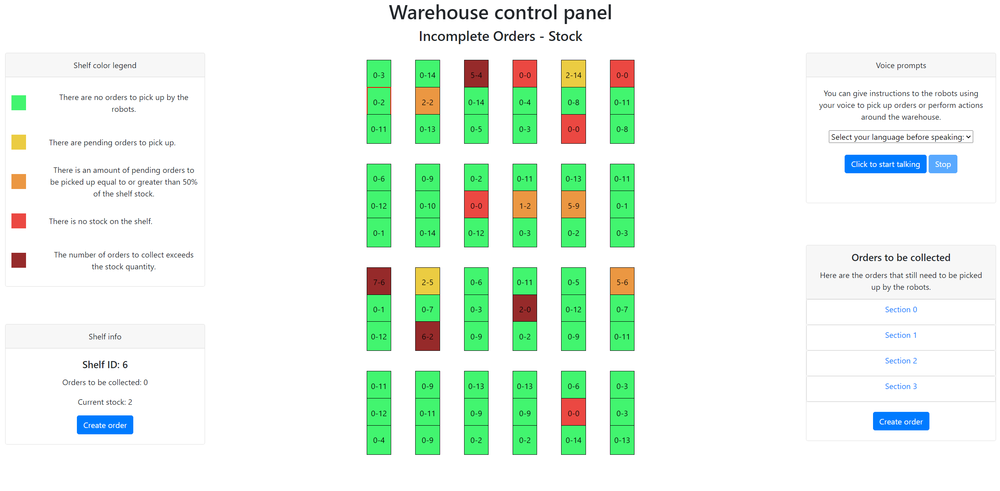
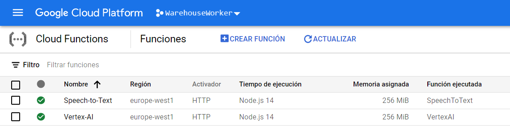
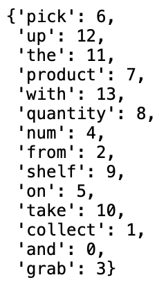

# Warehouse website

A website has been created for this project in order to manage the stock of the warehouse where the swarm operates. You can also create orders for the robots with your own voice or with a web interface that we have designed.

To make possible some of the functionalities of this website, several _Google Cloud APIs_ have been used. To publish the web we have used the _Firebase Hosting_ service.

🌍 [_The WarehouseWorker Control Web_](https://warehousewaiter.web.app)

# Website features

The website offers a visual representation of the warehouse stock. As mentioned above, it also allows operators to create orders either manually with buttons and text dialogues or with their own voice.

The following diagram summarizes the modules of the warehouse website in a graphical way:

## _Cloud Functions_

For the execution of the APIs, we decided to host their executions in Cloud Functions thanks to the [Cloud Functions API](https://cloud.google.com/functions/docs/reference/rest). This saved time and resources for the client. And on the other side, it made the coding easier, with this implementation we just needed to make a POST with the help of fetch() to the URL of the cloud function we wanted to execute.

## Create voice commands with the _Speech-to-Text API_

Orders for robots can be created with the voice using the voice prompts section. There you first select the language you are going to talk in because we pass that parameter to the [Speech to Text](https://cloud.google.com/speech-to-text) so it can do a proper transcription. Then you just click the start recording button and when you finish you click the stop one. 

An audio element will appear so you can listen to what you said. Under it, you have a cancel button in case you are not happy with the result. Next to it you also have the upload button, which will send the audio to the Speech to Text API.
Once the API is done, an alert will appear telling.

## Text processing with _Vertex AI_

The text is processed through the Vertex AI platform of Google Cloud to obtain the information about the order or the instruction that the operator wanted to give the robots with his voice.

First we have generated six different phrases that can be similar to commands that operators can ask robots.

The text that the operators order must always contain the identifier of the shelf and the product quantity of the package to be picked up, without being relevant which one is mentioned first. And from this command we want the two output values ​​to be predicted by means of meachine learning, that is, the two values ​​necessary to collect the package (shelf ID and product quantity).

In order to predict whether the value in the phrase is referring to the shelf identifier or the product quantity, we have processed the six phrases separately. First of all we have replaced the words “NUM1” and “NUM2” by “NUM”, and then we have generated triplets of consecutive words from each phrase, in order to take into account the order of the words due to the great importance that this has. As the only thing that interests us is to predict if the number that these three words contain refers to the shelf identifier or the product quantity, we eliminate all triples that do not contain the word “NUM” and therefore that do not contain a numerical value in the original phrases.
In the following image we can see the triples resulting from the first sentence of the operator once the triples that do not contain any value and therefore do not contain the word "NUM" have been eliminated.

So that the prediction algorithm can more easily predict, we have coded each of the words using the following dictionary.

Then we can see the result that we have left after having generated the triples in the first sentence, the subsequent elimination of the irrelevant triples and finally the encoding of each of the words.

The objective of all this process is to be able to create the following dataset where we see that we have separated the triplets into three different columns. These three columns will be our variable "x" and instead for the independent variable "y" we only have a single column which will have the value 0 if the number it refers to is the product quantity or it will have the value 1 if it refers to the shelf identifier.

This dataset that we have generated helps us to train the model. The supervised learning algorithm that we have used is the Decision Tree because it is a simple but powerful algorithm when partitioning data.

Therefore, from here on we already have a trained model and to test it we have created six new phrases. We have subjected these six phrases to the same process as the operator phrases at the beginning, that is, we have created the triples of each of the words, we have eliminated the irrelevant ones, we have encoded these words and we have made a prediction of the decision tree. This prediction allows us to know if the triplet contains the value of the shelf identifier or, on the contrary, the product quantity. Both the six sentences created for testing and the result of these six sentences can be seen in the last image below.

Having used this model and a Decision Tree has given voice instructions some flexibility in the phrases and words used by the human worker to create orders to the robots.

## Store orders in the _Firebase Realtime Database_

Orders are stored in the [Firebase](https://firebase.google.com/?hl=en) Realtime Database so that they can be consulted and retrieved at any time from any device.

The following image shows the map of the warehouse, where each square is a shelf. The number of the left of each shelf represents the number of orders left uncollected by the robots on that shelf, and the number of the right of the square is the total stock of that shelf.

We have made the map design automatically generated from variables that indicate the number of shelves per section and shelves per row to make the system scalable.

Each color has a meaning related to the pending orders and the stock of each shelf. Here we can see a legend with the meaning of each color shelf:

## Creating manual orders for robots

Through a dialog with text inputs, as shown in the image below, the operator can also create orders manually.

## Pending order list

There is also a convenient drop-down view with the different pending orders divided into each of the sections.

